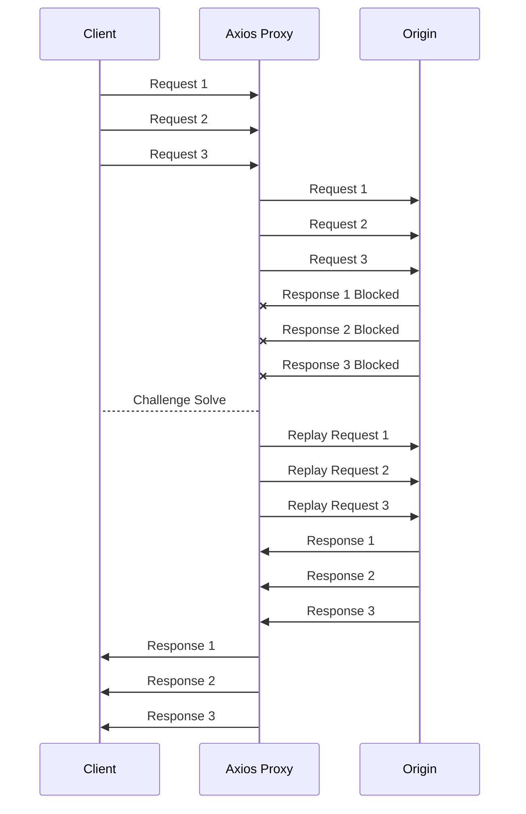

# perimeterx-axios-interceptor [](https://circleci.com/gh/fiverr/perimeterx-axios-interceptor) [](https://www.npmjs.com/package/perimeterx-axios-interceptor) [](https://fiverr.github.io/perimeterx-axios-interceptor/?appId=)

## 🧱 Intercept requests which are blocked by PerimeterX - pop up the challenge and retry the request

Using [Advanced Blocking Response](https://github.com/PerimeterX/perimeterx-nginx-plugin#-advanced-blocking-response) blocked JSON requests receive a JSON response with status 403. This response includes a payload which allow us to display PerimeterX's challenge. After visitor is exonerated, the original request will be sent and resolved using the original promise.

### Playground
[Visit the playground](https://fiverr.github.io/perimeterx-axios-interceptor/?appId=) to experience the behaviour

### Quick implementation
```js
import axios from 'axios';
import { attach } from 'perimeterx-axios-interceptor';

attach(axios);
```

### Implement all the things!
```js
import axios from 'axios';
import { attach, detach } from 'perimeterx-axios-interceptor';

attach(axios, {
    filter: ({ path }) => !/\/logger/.test(path),
    onintercept: request => logger.info(`Intercepted a block response from request ${request.url}`),
    onignore: request => logger.info(`Ignored a block response from request ${request.url}`),
    onsuccess: request => logger.info(`Exonerated a request to ${request.url}`),
    onfailure: (request, error) => logger.info(`Failed to exonerate request to ${request.url}: ${error.message}`),
    onerror: error => logger.error(error),
    simulate: true, // Will **not** load the challenge
    modalConfig: {
        className: 'my-challenge-popup',
        title: 'Are you human?',
        subtitle: 'Please complete the challenge',
        quickfixes: [
            '1. Disable adblocker',
            '2. Enable Javascript'
        ],
        suffix: 'Still having issues? Contact support at support@example.com',
        timeout: 3000
    }
});

// Remove the interceptor for some reason. Perhaps in order to re attach with different settings
detach(axios);
```

### Flow description
Using the feature [Advanced Blocking Response](https://github.com/PerimeterX/perimeterx-nginx-plugin#-advanced-blocking-response) featured in PerimeterX's NginX Lua plugin

1. Request is blocked by PerimeterX (403)
1. Challenge modal is added to UI
1. Challenge is resolved by user (user is exonerated)
1. Replay original request and resolve original promise


### HTML output

<details>
    <summary><strong>View full HTML output</strong></summary>

```html
<dialog class="perimeterx-async-challenge" open="open">
    <div>
        <p class="title">One Small Step</p>
        <p class="subtitle">Please check the box below to continue your normal visit</p>
        <div id="px-captcha" class="challenge-box">
            <!-- Challange markup (div.g-recaptcha) injected by PerimeterX Javascript -->
        </div>
        <p class="quickfix">Please exclude this website from ad blocking or ad filtering software.</p>
        <p class="quickfix">Make sure you don't have any browser extensions tampering with request headers or user agent string.</p>
        <p>If you're still having trouble accessing the site, please contact customer support.</p>
        <style>
.perimeterx-async-challenge {
    z-index: 10000;
    position: fixed;
    left: 0;
    top: 0;
    width: 100%;
    height: 100%;
    border: 0;
    margin: 0;
    padding: 0;
    background: rgba(0, 0, 0, .3);
    color: black;
}
.perimeterx-async-challenge > div {
    margin: 20vh 20vw 0;
    background: white;
    box-shadow: 0 0 2em rgba(0, 0, 0, .4);
    padding: 1em 1.5em;
}
.perimeterx-async-challenge p,
.perimeterx-async-challenge .challenge-box {
    margin: 0 0 .5em;
}
.perimeterx-async-challenge .title {
    font-size: 2em;
    font-weight: bold;
}
.perimeterx-async-challenge .subtitle {
    font-size: 1.4em;
}
.perimeterx-async-challenge .quickfix {
    font-size: .8em;
    margin: 0;
}
.perimeterx-async-challenge .quickfix:before {
    content: "•";
    margin: 0 .5em
}
@media screen and (max-width:1040px) {
    .perimeterx-async-challenge > div {
        margin: 10vh 10vw 0;
    }
}
@media screen and (max-width:800px) {
    .perimeterx-async-challenge > div {
        margin: 5vw 5vw 0;
    }
}
        </style>
    </div>
</dialog>
<script src="https://captcha.px-cdn.net/<PERIMETERX_APP_IP>/captcha.js"></script>
```

> If you add a custom class, `dialog` element will include **both class names**: `<dialog class="perimeterx-async-challenge my-challenge-popup" open>`

</details>

### API
#### 1st argument: `axios`
This is the Axios instance this plugin will intercept. If you use a global axios instance, just pass that one in
#### 2nd argument: options
This is an optional object. All of its properties are also optional:
##### `filter` {function}
Filter function is fired **before** the intercepting function. If filter is passed as an argument, it **must return a truthy value** for the interceptor to fulfil it's role. **Falsy values will result in the interceptor passing the response as is**.
It's signature includes the following named arguments:

| Name | Type | Meaning | Usage
| - | - | - | -
| `path` | string | Request original path | `filter: ({ path }) => !/^\/(tracking\|beacon)(\/\|$)/.test(path)`
| `appId` | string | PerimeterX Application ID | `filter: ({ appId }) => appId === window._pxAppId`

It is considered a good practice **not** to disrupt the user experience for background communication suck as liveness beacons, logs and metrics. The axios error will be thrown to the listener and will be added a new field, `ignored`, so that consumers can elect to ignore these skipped blocks.

> Requests that will fail the filter method will fire the "onignore" callback from your configuration.

```js
axios('/beacon')
    .catch(
        error => error.ignored
            ? logger.debug('Ignored blocked request')
            : logger.error(error)
    );
```

##### `onerror` {function}
This function is called when an internal error happened with this interceptor
The signature includes the error:
```js
onerror: (error) => logger.error(error)
```
##### `onintercept` {function}
This function is called on every time a request is recognised as a PerimeterX block.
The signature includes the original request object (axios.config):
```js
onintercept: (request) => logger.info({ message: 'Axios intercepted a PerimeterX block response', url: request.url })
```
##### `onignore` {function}
Similar to `onintercept`, only this will fire for **ignored** request that did not pass the `filter` method.
The signature includes the original request object (axios.config):
```js
onignore: (request) => logger.info({ message: 'Axios ignored a PerimeterX block response', url: request.url })
```
##### `onsuccess` {function}
This function is called when a challenge was successfully completed.
The signature includes the original request object (axios.config):
```js
onsuccess: (request) => logger.info({ message: 'Axios interceptor exonerated request', url: request.url })
```
##### `onfailure` {function}
This function is called when a challenge was successfully completed.
The signature includes the original request object (axios.config) and the rejection error:
```js
onfailure: (request, error) => logger.info({ message: error.message, url: request.url, stack: error.stack })
```
##### `simulate` {boolean}
Set "simulate" to a truthy value to allow monitoring without prompting users with exoneration.
The callback `onintercept` will fire, the rest will not. The promise will be rejected with the PerimeterX 403 response.
##### `modalConfig` {object}
This object allows configuration of the modal GUI:

- className (`{string}`): Add custom className to modal
    - **Default**: None
- title (`{string}`): Replace or disable default title
    - **Default**: "One Small Step"
- subtitle (`{string}`): Replace or disable default subtitle
    - **Default**: "Please check the box below to continue your normal visit"]
- quickfixes (`{string[]}`): Replace or disable default quick fixes (list)
    - **Default**:
        - "• Please exclude this website from ad blocking or ad filtering software."
        - "• Make sure you don't have any browser extensions tampering with request headers or user agent string.",
- suffix (`{string}`): Replace or disable default suffix
    - **Default**: "If you're still having trouble accessing the site, please contact customer support."
- timeout (`{number}`): Time, in milliseconds, to allow PerimeterX script to load before aborting
    - **Default**: 3000 (3 seconds)

> Setting "title", "subtitle", "quickfixes", or "suffix" to a falsy value (null, empty string...) will prevent them from being rendered to GUI.

```js
modalConfig: {
    className: 'my-challenge-modal',
    title: 'Just a little check',
    quickfixes: [
        '=> Turn off ad blockers',
        '=> Contact support if you need further assistance'
    ],
    suffix: null,
    timeout: 5000
}
```
## About axios instances
If you plan to [create axios instances](https://github.com/axios/axios#creating-an-instance), I suggest you consider using [axios-inherit](https://www.npmjs.com/package/axios-inherit) to add interceptor inheritance capability.

## Flow for simultaneous blocked requests



Simultaneous blocked requests will be solved in the same challenge solve. This means that if you have 3 blocked requests, the challenge will be solved once and all 3 requests will be replayed.

1. All requests will get a chance to hit the server and get blocked.
1. The first blocked response will trigger a challenge modal show.
1. Subsequent blocked responses will result in their respective requests being added to a queue.
1. A solve event will trigger a replay for each request in the queue by the order they were added.
1. Each request will be resolved with its respective response (original promise).
1. If the challenge fails to be solved, all requests will be rejected with the same error.

### Other possibilities I considered

#### Challenge for each blocked request
This would result in multiple challenges being shown to the user. This is not a good user experience.

#### When a challenge is shown - queue all requests
This could result in requests that should not be enforced by PerimeterX being blocked. This can result in data loss for business analytics, technical metrics, and marketing data.
Allowing some routes to pass this creates tight coupling between the enforcer configuration and the application code. This is not a good practice.

#### Disable modal close
This would result in a bad user experience. The user will be forced to solve the challenge before useing the site. Some blocked requests are not triggered by user interaction, and the user can continue to use the site without solving the challenge. Other times, this can limit the user's access to information they filled in a form, or other data they were working on, and can not post it (blocked) or save it (obstructed by modal).
